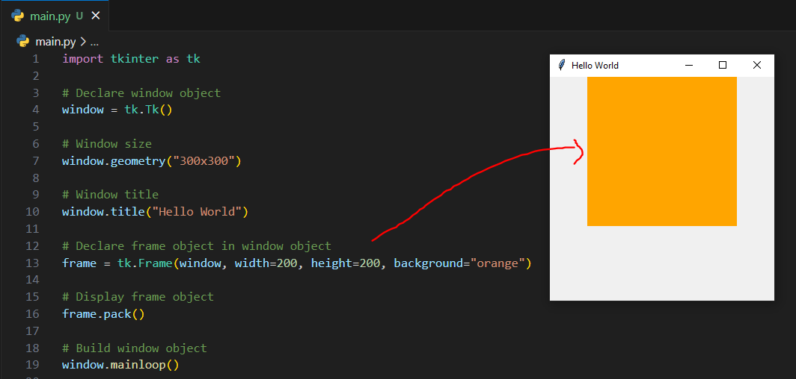
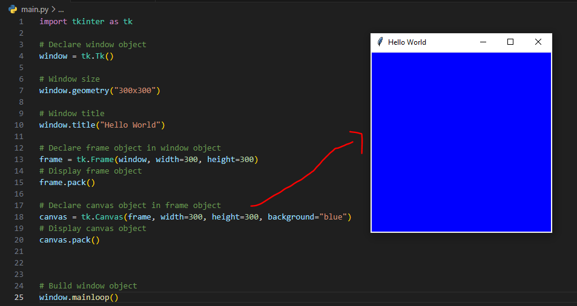
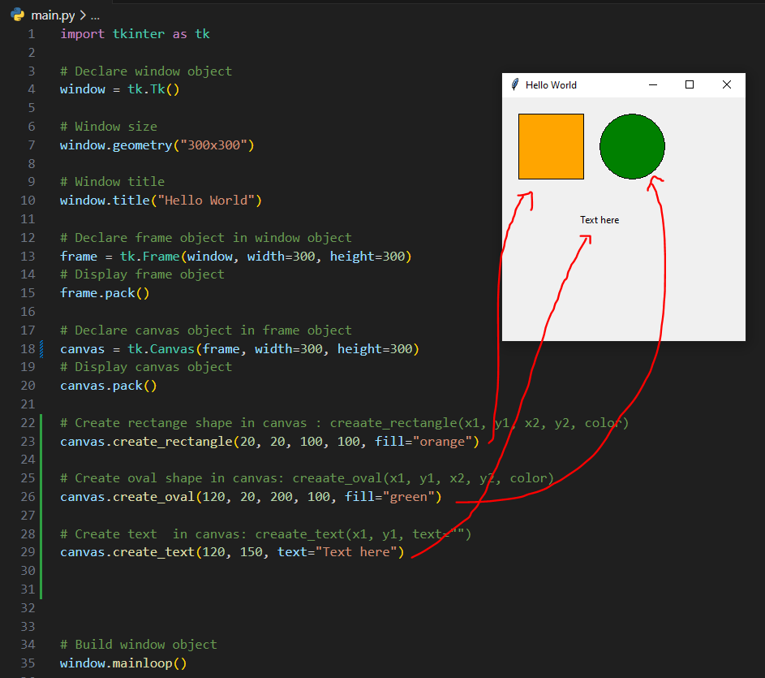

## Tkinter frame and canvas

#### Create frame container in window
```python
import tkinter as tk

# Declare window object
window = tk.Tk()

# Window size
window.geometry("300x300")

# Window title
window.title("Hello World")

# Declare frame object in window object
frame = tk.Frame(window, width=200, height=200, background="orange")

# Display frame object
frame.pack()

# Build window object
window.mainloop()

```

##### Example



#### Create canvas in frame container
```python
import tkinter as tk

# Declare window object
window = tk.Tk()

# Window size
window.geometry("300x300")

# Window title
window.title("Hello World")

# Declare frame object in window object
frame = tk.Frame(window, width=300, height=300)
# Display frame object
frame.pack()

# Declare canvas object in frame object
canvas = tk.Canvas(frame, width=300, height=300, background="blue")
# Display canvas object
canvas.pack()


# Build window object
window.mainloop()
```

##### Example



#### Create canvas in frame container
```python
import tkinter as tk

# Declare window object
window = tk.Tk()

# Window size
window.geometry("300x300")

# Window title
window.title("Hello World")

# Declare frame object in window object
frame = tk.Frame(window, width=300, height=300)
# Display frame object
frame.pack()

# Declare canvas object in frame object
canvas = tk.Canvas(frame, width=300, height=300)
# Display canvas object
canvas.pack()

# Create rectange shape in canvas : creaate_rectangle(x1, y1, x2, y2, color)
canvas.create_rectangle(20, 20, 100, 100, fill="orange")

# Create oval shape in canvas: creaate_oval(x1, y1, x2, y2, color)
canvas.create_oval(120, 20, 200, 100, fill="green")

# Create text  in canvas: creaate_text(x1, y1, text="")
canvas.create_text(120, 150, text="Text here")


# Build window object
window.mainloop()


```

##### Example

